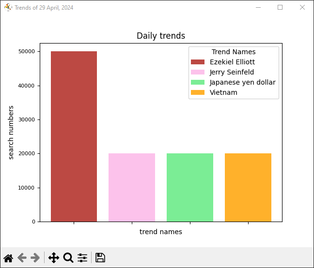
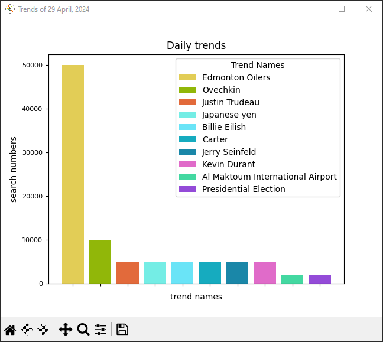

# google-daily-trends

Get daily search trends from the Google

## Index

- [Screenshot](#screenshot)
- [Requirements](#requirements)
- [General](#general)
- [Other](#other)

## Screenshot

* **USA Trends**

  

* **Canada Trends**

  

## Requirements

* install
  ``
  pip install -r requirements.txt
  ``

## General

* This script is intended for **educational** and **demonstration** purposes **only**.
* Just start this project, and it will show you Google search trends in your country. Also click on the bar
  will open up a browser and tell you what happened.
* Make sure that in your IDE option **Show plots in tool window** is disabled.

## Other

* If you find any issue, please don't hesitate to report it
  via [Issues](https://github.com/Fearplay/google-daily-trends/issues)
* If you have an idea to improve this game, please don't hesitate to create pull request
  via [Pull requests](https://github.com/Fearplay/google-daily-trends/pulls)
* Thanks to all :green_heart:

[Back to TOP](#google-daily-trends)